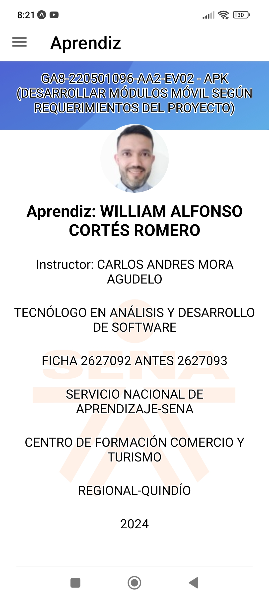

# - **Evidencia:** GA8-220501096-AA2-EV02 - APK (Desarrollar Módulos Móvil Según Requerimientos del Proyecto)

## Detalles de la Evidencia

- **Aprendiz:** William Alfonso Cortés Romero
- **Instructor:** Carlos Andres Mora Agudelo
- **Programa:** Tecnólogo en Análisis y Desarrollo de Software
- **Grupo:** Ficha 2627092 antes 2627093
- **Institución de Formación:** Servicio Nacional de Aprendizaje (SENA)
- **Centro de Formación:** Centro de Formación Comercio y Turismo
- **Región:** Regional Quindío
- **Año:** 2024

## Empezando

Para ejecutar la aplicación, simplemente corre

`yarn install && expo start`

Y escanea el código QR en la aplicación cliente de Expo.

## Vista del Aprendiz

### Repositorio

- [x] [Visita mi repositorio: https://github.com/WilliamCortes/GA8-220501096-AA2-EV02---APK-DESARROLLAR-M-DULOS-M-VIL-SEG-N-REQUERIMIENTOS-DEL-PROYECTO-](https://github.com/WilliamCortes/GA8-220501096-AA2-EV02---APK-DESARROLLAR-M-DULOS-M-VIL-SEG-N-REQUERIMIENTOS-DEL-PROYECTO-)
